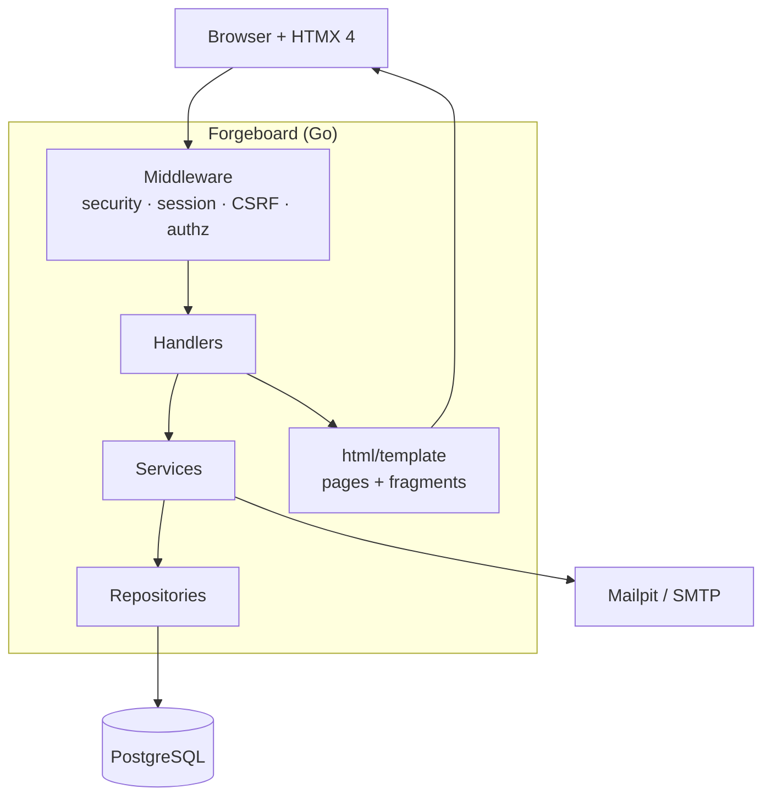

# Forgeboard

A compact issue tracker for small teams — **HTMX 4** + **Go (`net/http`)** + **PostgreSQL**.

Clone, `make dev`, and explore workspaces, projects, issues, comments, and activity without a SPA build step.

| | |
| --- | --- |
| Stack | Go 1.26 · `net/http` · `html/template` · HTMX **4.0.0-beta5** (vendored) · PostgreSQL · Docker Compose |
| App | http://localhost:8080 |
| Mailpit | http://localhost:8025 |
| Postgres | `localhost:5432` |

---

## Quick start

```bash
git clone https://github.com/kevin-voss/htmx-go-postgresql.git
cd htmx-go-postgresql
make dev
```

`make dev` builds the development image, starts Postgres + Mailpit, runs migrations, and serves the app.

Optional demo data (after the stack is up):

```bash
make seed
```

### Demo login

| Field | Value |
| ----- | ----- |
| Email | `demo@forgeboard.local` |
| Password | `demo-password` |
| Workspace | http://localhost:8080/w/demo |

Dev-only credentials — never use as production defaults.

### Useful commands

| Command | Purpose |
| ------- | ------- |
| `make help` | List targets |
| `make stop` | Stop containers |
| `make reset` | Remove containers + DB volume |
| `make test` | Migrate + run all tests |
| `make lint` | `go vet` + `gofmt` check |
| `make seed` | Insert/reset demo workspace |

---

## Architecture

Modular monolith: handlers → services → repositories → PostgreSQL. Templates and static assets are embedded in the binary.



More detail: [docs/architecture/overview.md](docs/architecture/overview.md).

---

## Threat model (notes)

| Area | Approach |
| ---- | -------- |
| Sessions | Opaque HttpOnly cookies; tokens hashed at rest; revocable |
| CSRF | Synchronizer token on state-changing requests |
| XSS | `html/template` auto-escaping for user content |
| SQLi | Parameterized `pgx` queries only |
| Authz | Workspace membership + Owner / Member / Viewer roles |

Fuller notes: [docs/architecture/threat-model.md](docs/architecture/threat-model.md).

---

## Production image

Multi-stage Dockerfile target `production` (static binary + migrate helper):

```bash
docker build --target production -t forgeboard:prod .
```

Set `DATABASE_URL`, `APP_ENV=production`, and SMTP settings at runtime. Run `migrate up` (WORKDIR `/app`) before serving traffic.

---

## CI

GitHub Actions ([`.github/workflows/ci.yml`](.github/workflows/ci.yml)) runs `make test` and builds the production image on pushes and pull requests.

---

## Screenshots

| Landing | Workspace / issues | Issue detail |
| ------- | ------------------ | ------------ |
| _TODO: add `docs/images/landing.png`_ | _TODO: add `docs/images/issues.png`_ | _TODO: add `docs/images/issue-detail.png`_ |

---

## Definition of done (quantitative)

| Requirement | Status |
| ----------- | ------ |
| ≥20 meaningful HTTP routes | Met (auth, workspaces, projects, issues, labels, comments, …) |
| ≥10 database tables | Met (13 tables across migrations) |
| ≥8 reusable HTML fragments | Met (`web/templates/fragments/`) |
| ≥5 middleware components | Met (security, session, CSRF, auth, membership/roles) |
| 3 roles | Owner · Member · Viewer |
| Handler / authz / repository tests | Present under `internal/` and `tests/integration/` |
| Password-reset flow | `/forgot-password` → `/reset-password/{token}` |
| Multi-target HTMX update | Comment create (`<hx-partial>`) |
| `422` validation fragment | Issue form errors |
| Activity written in a transaction | Issue/comment mutations |

Reviewer path: [docs/DEFINITION_OF_DONE.md](docs/DEFINITION_OF_DONE.md).

---

## Docs

| Doc | Purpose |
| --- | ------- |
| [Product](docs/specs/product.md) | Scope and promise |
| [Technology stack](docs/specs/technology-stack.md) | Pins and choices |
| [HTMX decision](docs/specs/htmx-decision.md) | Why HTMX 4.0.0-beta5 |
| [Architecture](docs/architecture/) | Layers, Docker, middleware |
| [Implementation](docs/implementation/) | Step plan and status |

## Explicit non-goals

No payments, OAuth, file uploads, WebSockets, Kubernetes, microservices, rich-text editor, time tracking, roadmaps, or sprint planning.
